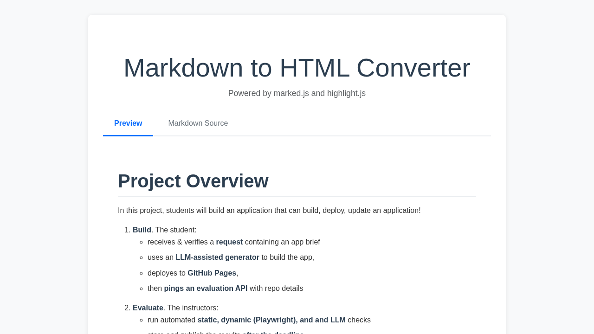

# Markdown to HTML Converter

A static web application that converts Markdown content to beautifully rendered HTML with syntax highlighting for code blocks.

## Description

This project fetches a Markdown file (`input.md`), converts it to HTML using the marked.js library, and renders it in the browser with syntax highlighting powered by highlight.js. The application provides a clean, professional interface for displaying converted Markdown content.

## Features

- 📝 **Markdown Conversion**: Converts Markdown to HTML using marked.js
- 🎨 **Syntax Highlighting**: Beautiful code syntax highlighting with highlight.js
- 📱 **Responsive Design**: Mobile-friendly layout using Bootstrap 5
- ⚡ **Fast Loading**: CDN-based libraries for optimal performance
- 🎯 **Error Handling**: Graceful error messages if content fails to load

## Technologies Used

- **HTML5**: Semantic markup structure
- **CSS3**: Custom styling with responsive design
- **JavaScript (ES6+)**: Modern async/await for file fetching
- **Bootstrap 5**: Responsive CSS framework
- **marked.js**: Markdown to HTML conversion library
- **highlight.js**: Syntax highlighting for code blocks

## How It Works

1. The page loads with the marked.js and highlight.js libraries from CDN
2. JavaScript fetches the `input.md` file from the same directory
3. The Markdown content is converted to HTML using `marked.parse()`
4. The HTML is injected into the `#markdown-output` element
5. Code blocks are automatically highlighted using highlight.js

## Usage

Simply open the page in a browser. The Markdown content from `input.md` will be automatically loaded, converted, and displayed with proper formatting and syntax highlighting.

## Deployment

- **Repository**: [https://github.com/mayanklearns/ai-agent-markdown-to-html-b2c3dd](https://github.com/mayanklearns/ai-agent-markdown-to-html-b2c3dd)
- **Live Demo**: [https://mayanklearns.github.io/ai-agent-markdown-to-html-b2c3dd/](https://mayanklearns.github.io/ai-agent-markdown-to-html-b2c3dd/)

## Preview



## Project Structure

```
markdown-to-html-b2c3dd/
├── index.html          # Main HTML page
├── script.js           # JavaScript for fetching and converting markdown
├── styles.css          # Custom styling
├── input.md            # Source markdown file
├── README.md           # This file
├── preview.png         # Screenshot
├── PLAN.md             # Project planning document
└── LICENSE             # MIT License
```

## License

This project is licensed under the MIT License - see the [LICENSE](LICENSE) file for details.
